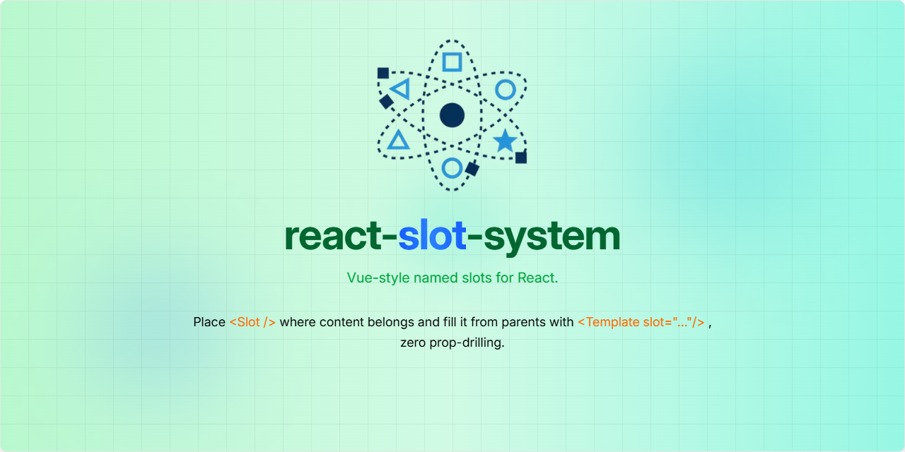

# React Slot System

Vue-style named slots for React: declare <Slot> in your component, fill from parents via <FillSlot> using the haveSlots HOC.



## Getting Started

Start by installing the package via your preferred package manager:

```sh
npm install react-slot-system
```

or, if using pnpm:

```sh
pnpm add react-slot-system
```

---

## ☕ 60-Second TL;DR

Vue-style named slots for React: declare `<Slot>` in your component, fill from parents via `<Template>` using the `hasSlots` HOC.

```tsx
import { hasSlots, Slot, Template } from 'react-slot-system';

// 1. Declare slots in your component with hasSlots
const Card = hasSlots(({ children }) => (
  <div className="card">
    <Slot name="header" />
    <div className="content">{children}</div>
    <Slot name="footer" fallback={<div>No footer</div>} />
  </div>
));

// 2. Fill slots from parent components
export default function App() {
  return (
    <Card>
      <Template slot="header">
        <h2>Card Title</h2>
      </Template>
      
      <p>This is the main content</p>
      
      <Template slot="footer">
        <button>Action</button>
      </Template>
    </Card>
  );
}
```

## Usage

### Basic Example

Create a layout component with named slots:

```tsx
import { hasSlots, Slot, Template } from 'react-slot-system';

const Layout = hasSlots(({ children }) => (
  <div className="layout">
    <header>
      <Slot name="header" fallback={<h1>Default Header</h1>} />
    </header>
    
    <main>{children}</main>
    
    <aside>
      <Slot name="sidebar" />
    </aside>
    
    <footer>
      <Slot name="footer" />
    </footer>
  </div>
));

function App() {
  return (
    <Layout>
      <Template slot="header">
        <nav>Custom Navigation</nav>
      </Template>
      
      <Template slot="sidebar">
        <div>Sidebar content</div>
      </Template>
      
      <div>Main page content goes here</div>
      
      <Template slot="footer">
        <p>&copy; 2024 My App</p>
      </Template>
    </Layout>
  );
}
```

### Dialog/Modal Example

```tsx
const Dialog = hasSlots(({ isOpen, onClose, children }) => {
  if (!isOpen) return null;
  
  return (
    <div className="modal-overlay">
      <div className="modal">
        <div className="modal-header">
          <Slot name="title" fallback="Dialog" />
          <button onClick={onClose}>×</button>
        </div>
        
        <div className="modal-body">
          {children}
        </div>
        
        <div className="modal-footer">
          <Slot name="actions" fallback={
            <button onClick={onClose}>Close</button>
          } />
        </div>
      </div>
    </div>
  );
});

// Usage
<Dialog isOpen={showDialog} onClose={() => setShowDialog(false)}>
  <Template slot="title">
    <h2>Confirm Action</h2>
  </Template>
  
  <p>Are you sure you want to delete this item?</p>
  
  <Template slot="actions">
    <button onClick={handleDelete}>Delete</button>
    <button onClick={() => setShowDialog(false)}>Cancel</button>
  </Template>
</Dialog>
```

---

## API Reference

### `hasSlots(Component)`

A Higher-Order Component that enables slot functionality for your components.

**⚠️ Important Requirements:**
- Your component **MUST** accept `children` prop (use `PropsWithChildren<YourProps>`)
- Your component **MUST** render `{children}` in its JSX
- Without these, `<Template>` components won't work properly

**Parameters:**

| Parameter   | Type              | Description                               |
|-------------|-------------------|-------------------------------------------|
| `Component` | `React.FC<Props>` | The React component to enhance with slots |

**Returns:**

- Type: `React.FC<ComponentProps<typeof Component>>`  
A new component that supports slot functionality while preserving all original props.

**Example:**

```tsx
// ✅ CORRECT - Has children prop and renders {children}
const MyComponent = hasSlots(({ title, children }: PropsWithChildren<{ title: string }>) => (
  <div>
    <h1>{title}</h1>
    <Slot name="header" />
    {children}  {/* This is REQUIRED */}
    <Slot name="footer" />
  </div>
));

// ❌ WRONG - Missing children prop or not rendering {children}
const BrokenComponent = hasSlots(({ title }: { title: string }) => (
  <div>
    <h1>{title}</h1>
    <Slot name="header" />
    {/* Missing {children} - Templates won't work! */}
  </div>
));
```

### `<Slot />`

A component that renders content assigned to a named slot.

**Props:**

| Prop       | Type              | Required | Description                                     |
|------------|-------------------|----------|-------------------------------------------------|
| `name`     | `string`          | Yes      | The unique identifier for the slot              |
| `fallback` | `React.ReactNode` | No       | Content to show when no template fills the slot |

**Example:**

```tsx
<Slot name="header" />
<Slot name="sidebar" fallback={<div>Default sidebar</div>} />
```

### `<Template />`

A component that defines content for a specific slot. It doesn't render directly but provides content to the corresponding `<Slot />`.

**Props:**

| Prop       | Type              | Required | Description                       |
|------------|-------------------|----------|-----------------------------------|
| `slot`     | `string`          | Yes      | The name of the slot to fill      |
| `children` | `React.ReactNode` | No       | The content to render in the slot |

**Example:**

```tsx
<Template slot="header">
  <nav>Navigation content</nav>
</Template>
```

---

## Key Features

- **Lightweight**: Minimal overhead with efficient context usage
- **Performance optimized**: Uses [`react-ctx-selector`](https://github.com/HichemTab-tech/react-context-selector) for optimal re-renders
- **Flexible**: Support for fallback content and conditional slots
- **Developer-friendly**: Simple API with clear separation of concerns

## How It Works

1. **`hasSlots`** wraps your component with a context provider that manages slot content
2. **`<Template>`** components register their content with specific slot names during render
3. **`<Slot>`** components retrieve and render the content assigned to their name
4. The system uses `useLayoutEffect` to ensure proper timing and prevent flickering

**📋 Requirements for slot system to work:**
- Component wrapped with `hasSlots` must accept `children` prop (`PropsWithChildren<T>`)
- Component must render `{children}` in its JSX tree
- `<Template>` components are passed as children and register themselves automatically

## When to Use

- **Layout components** with multiple content areas
- **Modal/Dialog systems** with customizable headers, bodies, and footers
- **Card components** with optional sections
- **Dashboard layouts** with configurable widgets
- **Any component** that needs flexible content composition

---

## 🤝 Contributions

Contributions are welcome! Feel free to:

1. Fork the repository
2. Create your Feature Branch (`git checkout -b feature/AmazingFeature`)
3. Commit your Changes (`git commit -m 'Add some AmazingFeature'`)
4. Push to the Branch (`git push origin feature/AmazingFeature`)
5. Open a Pull Request

Please follow existing coding styles and clearly state your changes in the pull request.

## ❓ FAQ

**Q: Why do I get TypeScript errors when using hasSlots?**  
A: Your component must accept `children` prop using `PropsWithChildren<YourProps>` and render `{children}` in its JSX. Without this, Templates won't work and TypeScript will show errors.

**Q: Can I use multiple Templates for the same slot?**  
A: The last Template rendered for a given slot name will be used. Templates override each other.

**Q: What happens if I don't provide a Template for a Slot?**  
A: The Slot will render its `fallback` prop if provided, otherwise it renders nothing.

**Q: My Templates aren't rendering, what's wrong?**  
A: Make sure your component wrapped with `hasSlots` renders `{children}` in its JSX. Templates are passed as children and need to be rendered to register themselves.

**Q: How does this compare to React's children prop?**  
A: While `children` allows one content area, slots enable multiple named content areas with fallbacks and better composition patterns.

## Issues

If you encounter any issue, please open an issue [here](https://github.com/HichemTab-tech/react-slot-system/issues).

## License

Distributed under the MIT License. See [`LICENSE`](LICENSE) file for more details.

&copy; 2025 [Hichem Taboukouyout](mailto:hichem.taboukouyout@hichemtab-tech.me)

---

_If you found this package helpful, consider leaving a star! ⭐️_
